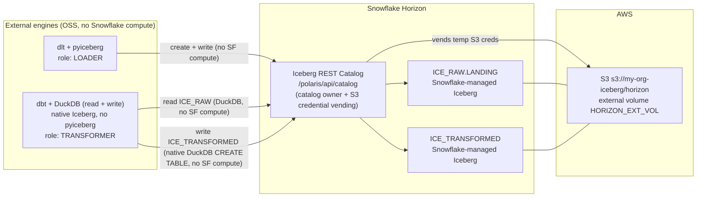

# Horizon Iceberg Demo

**Bi-directional, multi-engine read/write on Snowflake-managed Apache Iceberg — with zero Snowflake compute.**

`Snowflake Horizon` · `Apache Iceberg REST Catalog` · `dlt` · `pyiceberg` · `DuckDB (native read + write)` · `dbt` · `Terraform` · `zero compute` · `no licensed connector`

📖 **The story behind this repo:** [_This is the Iceberg dream: load, transform, and serve Snowflake-managed Iceberg with zero Snowflake compute_](blog/iceberg-v3-the-dream.md)

---

## What & why

Snowflake Horizon's **Iceberg REST Catalog** (external-write, public preview 2026) lets *external* engines create and write **Snowflake-managed** Iceberg tables directly. This repo proves it end-to-end:

- **Open-source dlt + pyiceberg** commit a brand-new Iceberg table into Snowflake over the REST catalog — **no Snowflake virtual warehouse runs, and no licensed/`snowflake_plus` connector is involved.**
- **Snowflake stays the catalog owner.** It governs the table, controls its physical location under an external volume, and **vends temporary S3 credentials** at write time — so no long-lived AWS keys live in the engine.
- **dbt Fusion + DuckDB** is the transformer: it **reads `ICE_RAW`** through the same REST catalog and **persists a staging model into `ICE_TRANSFORMED`** — again with no Snowflake compute. Fusion's DuckDB does it all natively: a stock `materialized: table` bound to the catalog writes the Snowflake-managed Iceberg table straight through the REST catalog (DuckDB ≥ 1.5.4 + the [duckdb-iceberg#1017](https://github.com/duckdb/duckdb-iceberg/pull/1017) write-compat options, exposed by Fusion ≥ preview.194) — **no pyiceberg, no parquet round-trip, no plugin**. See [dbt/](dbt/) and [dbt/NOTES_horizon_write_path.md](dbt/NOTES_horizon_write_path.md).

The punchline: Snowflake is the **governed catalog + storage broker**; all compute is external and open-source.

---

## Architecture



Engine → catalog edges carry **no Snowflake compute**: dlt/pyiceberg and dbt Fusion/DuckDB perform all read/write work themselves and only use Horizon for catalog metadata + scoped, temporary S3 credentials.

---

## Quickstart

> Prereqs: `terraform`, the `snow` CLI (a connection, referenced below as `my-connection`), `uv`, an AWS profile (referenced as `my-aws-profile`, region `us-east-2`), and `ACCOUNTADMIN` on your Snowflake account. Set your org/account identifier (org `MYORG`, account `MYACCT` → host `myorg-myacct.snowflakecomputing.com`) in `tf/snowflake/terraform.tfvars` and `.env`.

### 1. Configure your environment (`.env`)

Create the gitignored `.env` at the repo root first — later steps source it and append the PATs into it. Fill in your org/account host; leave the PAT values as placeholders for now (you'll capture the real tokens in step 4):

```dotenv
HORIZON_CATALOG_URI=https://myorg-myacct.snowflakecomputing.com/polaris/api/catalog
HORIZON_READ_WAREHOUSE=ICE_RAW
HORIZON_WRITE_WAREHOUSE=ICE_TRANSFORMED
HORIZON_LOAD_PAT=<HORIZON_LOAD_PAT>
HORIZON_PAT=<HORIZON_PAT>
```

### 2. Provision AWS, then Snowflake

```bash
cd <repo>/tf/aws
terraform init && terraform apply

cd <repo>/tf/snowflake
terraform init && terraform apply
```

> Trust-policy note: `tf/aws` first applies with an account-root placeholder principal; after the external volume exists, set `snowflake_iam_user_arn` + `snowflake_external_id` from `DESC EXTERNAL VOLUME HORIZON_EXT_VOL` in `tf/aws/terraform.tfvars` and re-apply to lock the IAM trust down to Snowflake's real principal.

### 3. Create the access layer (roles, grants, network policy, service user)

```bash
cd <repo>
snow sql -f sql/horizon_access.sql --role ACCOUNTADMIN -c my-connection
```

### 4. Issue the two role-restricted PATs

Each token secret is returned **once** — capture it straight into the `.env` you created in step 1, replacing the `<HORIZON_LOAD_PAT>` / `<HORIZON_PAT>` placeholders (never echo it to a log):

```bash
snow sql -q "ALTER USER HORIZON_SVC ADD PAT HORIZON_LOAD_PAT DAYS_TO_EXPIRY=7 \
  ROLE_RESTRICTION='LOADER'      COMMENT='dlt external Iceberg REST loader'" \
  --role ACCOUNTADMIN -c my-connection --format json

snow sql -q "ALTER USER HORIZON_SVC ADD PAT HORIZON_PAT DAYS_TO_EXPIRY=7 \
  ROLE_RESTRICTION='TRANSFORMER' COMMENT='dbt-duckdb external Iceberg REST'" \
  --role ACCOUNTADMIN -c my-connection --format json
```

(See `sql/issue_pat.sql` for the canonical commands and how to `REMOVE PAT` before re-issuing.)

> **TODO:** Steps 2 (Snowflake Terraform) and 3 (`horizon_access.sql`) should be collapsed into a single Snowflake setup step — fold the `tf/snowflake` objects and grants into the SQL so there's one Snowflake setup action instead of two.

### 5. Populate dlt secrets (placeholders only — never commit real values)

`dlt/.dlt/secrets.toml` — the Iceberg REST catalog config (the `[iceberg_catalog.iceberg_catalog_config]` keys), with the loader PAT supplied as `credential` (not `token`), plus `[destination.filesystem.credentials]` `profile_name = "my-aws-profile"` for dlt's S3 bookkeeping. Use `<HORIZON_LOAD_PAT>` as a placeholder — **do not paste a real token.**

### 6. Run the loader

```bash
cd <repo>/dlt
uv run python hello_world_pipeline.py
```

### 7. Verify the table from Snowflake

```bash
snow sql -q "SELECT * FROM ICE_RAW.LANDING.HELLO_WORLD" --role LOADER -c my-connection
```

You should see the two seeded rows — written by OSS dlt over the REST catalog, with no Snowflake warehouse ever started.

### 8. Transform with dbt (read `ICE_RAW` → persist `ICE_TRANSFORMED`)

```bash
cd <repo>/dbt
dbt system update                             # dbt Fusion >= preview.194 (bundles DuckDB 1.5.4)
set -a; source ../.env; set +a
source ../refresh_token.sh         # mints HORIZON_TOKEN (TRANSFORMER, ~60 min)
dbt run                                        # Fusion: reads ICE_RAW, writes ICE_TRANSFORMED.STAGING.STG_HELLO_WORLD natively
dbt show --inline "select * from {{ ref('stg_hello_world') }} order by created_at"
```

Fusion's DuckDB does it all natively — a stock `materialized: table` bound to the catalog writes
the Snowflake-managed Iceberg table straight through the REST catalog (no pyiceberg, no parquet
round-trip, no plugin). See [dbt/README.md](dbt/README.md) and
[dbt/NOTES_horizon_write_path.md](dbt/NOTES_horizon_write_path.md) (incl. the stock dbt-core fallback).

---

## Repo layout

| Path | Purpose |
| --- | --- |
| `tf/aws/` | S3 bucket `my-org-iceberg`, IAM policy + role Snowflake assumes (scoped to `horizon/*`). |
| `tf/snowflake/` | External volume `HORIZON_EXT_VOL`, databases `ICE_RAW` / `ICE_TRANSFORMED`, schema `ICE_RAW.LANDING` (all Iceberg-by-default). |
| `sql/horizon_access.sql` | Roles `LOADER` / `TRANSFORMER` grants, network policy, service user `HORIZON_SVC`. |
| `sql/issue_pat.sql` | Issues the two role-restricted PATs (`HORIZON_LOAD_PAT`, `HORIZON_PAT`). |
| `dlt/hello_world_pipeline.py` | The verified loader: writes `ICE_RAW.LANDING.HELLO_WORLD` via the REST catalog. |
| `dlt/.dlt/config.toml` | Case-sensitive naming + bucket URL for the filesystem destination. |
| `dlt/.dlt/secrets.toml` | Iceberg REST catalog connection + PAT credential. **Gitignored — never committed.** |
| `dbt/` | The TRANSFORMER: **dbt Fusion + DuckDB** reads `ICE_RAW` and writes the `stg_hello_world` staging model natively into `ICE_TRANSFORMED` (both halves via DuckDB + the Horizon REST catalog). See [dbt/README.md](dbt/README.md). |
| `dbt/catalogs.yml` | catalogs.yml v2 — `ice_raw` (read) + `ice_transformed` (write, with the four duckdb-iceberg#1017 write-compat options). |
| `dbt/*.duckdb.yml`, `dbt/macros-duckdb/` | Fallback config for stock dbt-core (no Fusion) — native write via attach options + a custom materialization (see NOTES). |
| `dbt/NOTES_horizon_write_path.md` | How DuckDB writes Iceberg to Horizon natively — the four write-compat ATTACH options + the two dbt gotchas, with evidence. |
| `motherduck/` | Standalone DuckDB read path (token shim + `explore.sql`) — the original TRANSFORMER-read proof. |
| `.env` | REST URI, warehouse (= database) names, and PAT placeholders. **Gitignored.** |

---

## Data flow & roles

| Role | Engine | Reads | Writes | Auth |
| --- | --- | --- | --- | --- |
| **LOADER** | dlt + pyiceberg | — | `ICE_RAW.LANDING` (creates Iceberg tables) | `HORIZON_LOAD_PAT` (role-restricted to `LOADER`) |
| **TRANSFORMER** | dbt Fusion + DuckDB (native read + write) | `ICE_RAW` | `ICE_TRANSFORMED` (staging table, native DuckDB `CREATE TABLE`) | `HORIZON_PAT` (role-restricted to `TRANSFORMER`) |

- **`HORIZON_SVC`** is a single `TYPE = SERVICE` user that holds **both** roles. The active role is chosen **per session** by the OAuth scope at token-exchange (`session:role:LOADER` vs `session:role:TRANSFORMER`).
- Because this account **enforces a role restriction on every PAT**, one unrestricted token cannot serve both roles — hence **two** role-restricted PATs on the one service user.

---

## Gotchas — if you're an agent picking this up

- **Hostname uses a HYPHEN, not an underscore.** Org `MYORG` + account `MYACCT` → `myorg-myacct.snowflakecomputing.com`. Python's `ssl` rejects the underscore form (`CERTIFICATE_VERIFY_FAILED: Hostname mismatch`); `curl`/OpenSSL tolerate it. Use the hyphen form everywhere in code/`.env`/`secrets.toml`.
- **pyiceberg auth wants `credential`, not `token`.** A raw PAT as `Authorization: Bearer` returns **401** — Horizon requires an OAuth2 token-exchange (`POST {uri}/v1/oauth/tokens`, `grant_type=client_credentials`, `scope=session:role:<ROLE>`, `client_secret=<PAT>`). Passing the PAT as the catalog `credential` makes pyiceberg perform that exchange; passing it as `token` skips it and fails.
- **Two PATs, by design.** This account enforces `ROLE_RESTRICTION` on every PAT, so the one `HORIZON_SVC` user needs separate `LOADER` and `TRANSFORMER` tokens. The OAuth scope at exchange must match the restriction.
- **`type = "rest"` lives inside the inner dict.** It belongs in `[iceberg_catalog.iceberg_catalog_config]`, not the outer `[iceberg_catalog]` table.
- **Case-sensitive naming (`naming = "sql_cs_v1"`).** Keeps identifiers UPPERCASE verbatim so they match `ICE_RAW.LANDING` / `HELLO_WORLD`; the default snake_case would lowercase them and miss the schema.
- **`create_table` location shim.** Snowflake-managed Iceberg rejects an explicit table location ("Creating a table with an explicit location is not allowed") — Horizon assigns it under `HORIZON_EXT_VOL`. The pipeline wraps `dlt.common.libs.pyiceberg.create_table` to drop `location` on first creation; this is the intended external-write flow.
- **The filesystem destination still needs its own S3 creds.** Set `profile_name = "my-aws-profile"` under `[destination.filesystem.credentials]` for dlt's own bookkeeping — even though Horizon vends the temporary creds for the actual Iceberg data write.
- **`warehouse` = the database name.** In the REST catalog config, `warehouse` is the Snowflake database (e.g. `ICE_RAW`), **not** a Snowflake virtual warehouse.
- **DuckDB won't uppercase table names — Snowflake's engine does that, and we bypass it.** In normal Snowflake dbt, lowercase model filenames become UPPERCASE tables because Snowflake folds unquoted identifiers at parse time. Here the writes are executed by DuckDB, which is case-*preserving*, so a `stg_hello_world.sql` model lands as lowercase `stg_hello_world` in the catalog. No quoting config changes this (quoting ≠ case folding). The fix is to reproduce the folding dbt-side: [dbt/macros/generate_alias_name.sql](dbt/macros/generate_alias_name.sql) `| upper`s every alias, so you keep production-style lowercase filenames and still get uppercase identifiers. Symmetric with the existing `generate_schema_name` override.

---

## Security notes

- **Secrets are never committed.** They live only in gitignored `.env` and `dlt/.dlt/secrets.toml` (both covered by `.gitignore`), and never appear in Terraform state.
- **The `0.0.0.0/0` network policy is demo-only.** `HORIZON_SVC_NETPOL` is required before a `TYPE = SERVICE` user can hold/use a PAT; it's scoped to `HORIZON_SVC` (not the account). Restrict `ALLOWED_IP_LIST` to your egress IPs for anything real.
- **PATs expire in 7 days.** Re-issue with `sql/issue_pat.sql` (and `REMOVE PAT` first if re-adding the same name).
- **No long-lived AWS keys in the engine.** Horizon vends temporary, scoped S3 credentials at write time.

---

## Next steps

- **✅ Native write on dbt Fusion (done).** The plugin is gone — Fusion (preview.194) + DuckDB ≥ 1.5.4
  writes the staging model to Horizon directly via a stock `materialized: table` + the duckdb-iceberg#1017
  write-compat options in catalogs.yml v2. See [dbt/NOTES_horizon_write_path.md](dbt/NOTES_horizon_write_path.md).
- **More models.** Add marts on top of `stg_hello_world`; bind any of them to `ice_transformed` to persist into `ICE_TRANSFORMED`.
- **Incremental.** Swap the staging model's full overwrite for an append/merge once the source grows.
