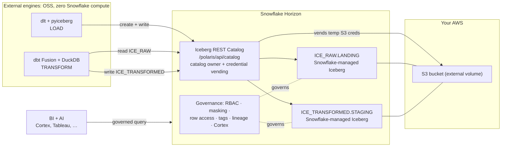

# This is the Iceberg dream: load, transform, and serve Snowflake-managed Iceberg with zero Snowflake compute

There's a version of the open lakehouse that everyone keeps drawing on whiteboards and nobody quite ships. It goes like this: your tables live in your own cloud storage, in an open format, readable by any engine. But they're still *governed*: one catalog, one set of grants, one place where masking and lineage and tags live. Open storage on the bottom, real governance on top.

That's the dream. And I want to show you that it's not a whiteboard anymore. You can do the whole loop today:

1. **Land** raw data as Apache Iceberg in your own S3 bucket, with **no Snowflake warehouse running**.
2. **Transform** it into a new Iceberg table. Again: **no Snowflake warehouse running**.
3. **Serve** it to AI and BI with **every bit of Snowflake governance you already trust**: RBAC, masking policies, row-access policies, tags, lineage, Cortex.

The thing that makes this click is **Snowflake Horizon's Iceberg REST Catalog**. And the punchline I keep coming back to: you don't set it up. It's already there. You don't even turn it on. It's on.

Let me show you.

---

## The "wait, what" up front

Here's the part that surprised me enough to build the whole repo this article is based on.

Snowflake-managed Iceberg tables, the ones Snowflake fully governs, can be **created and written by external, open-source engines**, over a standard Iceberg REST Catalog API, with Snowflake never spinning up a warehouse to do the write. Snowflake stays the catalog owner. It decides where the bytes go (under an external volume you own). It **vends temporary, scoped S3 credentials** at write time. But the actual compute (the bytes-to-parquet, the commit) happens in *your* engine.

So the engine that writes your table is `dlt`. Or DuckDB. Or dbt. Running on your laptop, or a tiny container, or a Lambda. And the table that comes out the other side is, to Snowflake, a first-class governed table. Not an "external table" it squints at. A real one.

If you've set up DuckLake, you know the shape of this: open data, a catalog database holding the metadata. DuckLake is great. But DuckLake asks you to stand up and babysit a catalog database, usually a Postgres. Here, the catalog is **Snowflake Horizon**, which you already have, already running, already governed, already backed up, already audited. There is no catalog database to provision. There is no Postgres. There is nothing to turn on.

That's the part I can't get over. The hardest infrastructure in the open lakehouse, the governed catalog, is the one piece you don't build.

---

## What "Iceberg REST Catalog" actually means here

Quick level-set, because the words matter.

[Apache Iceberg](https://iceberg.apache.org/) is the open table format: your data is parquet files in your bucket, plus a metadata tree that gives you ACID commits, schema evolution, and time travel. The **REST Catalog** is the open API spec that tells an engine *where the current metadata is* and *coordinates commits* so two writers don't clobber each other.

Snowflake Horizon implements that REST Catalog API and points it at Snowflake-managed Iceberg tables. So when DuckDB or dlt speaks the Iceberg REST protocol, Snowflake answers, as the catalog. The endpoint looks like this:

```
https://<your-account>.snowflakecomputing.com/polaris/api/catalog
```

Two things to internalize:

- In REST-catalog speak, the **`warehouse`** is your Snowflake **database** (e.g. `ICE_RAW`), *not* a virtual warehouse. No compute is implied by the word.
- Auth is an **OAuth2 token exchange**. You hand Horizon a Snowflake Programmatic Access Token (PAT) as the `client_secret`, with a scope like `session:role:TRANSFORMER`, and it hands you back a short-lived bearer token. Your role, and every grant attached to it, rides along on that token.

That second point is the whole governance story in one sentence: **the catalog hands out access by Snowflake role.** Hold that thought; it comes back in the "serve" section.

---

## The architecture, on one screen



Every arrow from an engine into the catalog carries **no Snowflake compute**. The engines do the work; Horizon governs and brokers. The data sits in your bucket the whole time.

---

## The one-time foundation (and why it's not the catalog)

I want to be honest with you, because you're an engineer and you'll smell it if I'm not: there *is* setup here. But notice **what** you're setting up. You are not setting up a catalog. You're setting up two things you'd set up for *any* governed data:

1. **Where the bytes live.** An S3 bucket and a Snowflake *external volume* that points at it, with an IAM role Snowflake assumes. This is the "your storage, your bucket" part of the open lakehouse.
2. **Who can touch it.** A couple of Snowflake roles and a service user with Programmatic Access Tokens. This is just Snowflake RBAC. You already know it.

The companion repo does all of this with Terraform + a little SQL, so you can read every line. Storage:

```hcl
# tf/snowflake: the external volume + Iceberg-by-default databases
resource "snowflake_external_volume" "horizon" {
  name = "HORIZON_EXT_VOL"
  storage_location {
    storage_location_name = "horizon-s3"
    storage_provider      = "S3"
    storage_base_url      = "s3://my-org-iceberg/horizon/"
    storage_aws_role_arn  = aws_iam_role.snowflake.arn
  }
}

resource "snowflake_database" "ice_raw" {
  name                                      = "ICE_RAW"
  external_volume                           = snowflake_external_volume.horizon.name
  catalog                                   = "SNOWFLAKE"   # Snowflake-managed Iceberg
  storage_serialization_policy              = "OPTIMIZED"
  default_ddl_collation                     = ""
}
```

Access: plain RBAC, two roles, a service user that holds them.

```sql
-- sql/horizon_access.sql (abridged)
CREATE ROLE IF NOT EXISTS LOADER;       -- writes ICE_RAW
CREATE ROLE IF NOT EXISTS TRANSFORMER;  -- reads ICE_RAW, writes ICE_TRANSFORMED

GRANT USAGE ON DATABASE ICE_RAW TO ROLE TRANSFORMER;
GRANT USAGE ON SCHEMA ICE_RAW.LANDING TO ROLE TRANSFORMER;
GRANT SELECT ON ALL ICEBERG TABLES IN SCHEMA ICE_RAW.LANDING TO ROLE TRANSFORMER;
GRANT SELECT ON FUTURE ICEBERG TABLES IN SCHEMA ICE_RAW.LANDING TO ROLE TRANSFORMER;

GRANT USAGE ON DATABASE ICE_TRANSFORMED TO ROLE TRANSFORMER;
GRANT CREATE SCHEMA ON DATABASE ICE_TRANSFORMED TO ROLE TRANSFORMER;

CREATE USER IF NOT EXISTS HORIZON_SVC TYPE = SERVICE;
GRANT ROLE LOADER, TRANSFORMER TO USER HORIZON_SVC;
```

Then you issue the tokens. Each engine gets a PAT scoped to exactly one role, least privilege baked in:

```bash
snow sql -q "ALTER USER HORIZON_SVC ADD PAT HORIZON_LOAD_PAT DAYS_TO_EXPIRY=7 \
  ROLE_RESTRICTION='LOADER'      COMMENT='dlt loader'"      --role ACCOUNTADMIN
snow sql -q "ALTER USER HORIZON_SVC ADD PAT HORIZON_PAT      DAYS_TO_EXPIRY=7 \
  ROLE_RESTRICTION='TRANSFORMER' COMMENT='dbt transformer'" --role ACCOUNTADMIN
```

That's it. That's the foundation. Storage you own, roles you grant. **Nowhere in there did you build a catalog**, because the catalog is Horizon, and Horizon is just… on.

> One real gotcha worth saving you an hour: the hostname uses a **hyphen**, not an underscore. It's `myorg-myacct.snowflakecomputing.com`, and Python's `ssl` rejects the underscore form. `curl` tolerates it, so it'll look like it works until your pipeline doesn't.

---

## Pillar 1: Load, with no Snowflake compute

The loader is [`dlt`](https://dlthub.com/) using its open-source `filesystem` destination with `table_format="iceberg"`, pointed at the Horizon REST catalog. No `dlt+`, no licensed connector. dlt writes the parquet and commits through the catalog with pyiceberg; Horizon vends the S3 creds.

The catalog connection lives in `dlt`'s secrets, and the only Snowflake-specific trick is this: Snowflake-managed Iceberg assigns the table location *itself* (under your external volume), so it rejects a client-supplied location. We wrap dlt's `create_table` to omit it:

```python
import dlt
from dlt.destinations import filesystem
import dlt.common.libs.pyiceberg as _ice
import pyarrow as _pa

# Snowflake Horizon assigns the table location under the external volume and
# rejects a client-supplied one, so drop `location` on create. That's the
# intended external-write flow.
def _create_no_location(catalog, table_id, table_location, schema, **kw):
    if isinstance(schema, _pa.Schema):
        schema = _ice.ensure_iceberg_compatible_arrow_schema(schema)
    catalog.create_table(identifier=table_id, schema=schema,
                         partition_spec=kw.get("partition_spec", _ice.UNPARTITIONED_PARTITION_SPEC),
                         properties=kw.get("properties") or {})
_ice.create_table = _create_no_location


@dlt.resource(table_name="HELLO_WORLD", write_disposition="append",
              primary_key="ID", table_format="iceberg")
def hello_world():
    import datetime as dt, uuid
    now = dt.datetime.now(dt.timezone.utc)
    yield [
        {"ID": str(uuid.uuid4()), "MESSAGE": "hello", "CREATED_AT": now},
        {"ID": str(uuid.uuid4()), "MESSAGE": "world", "CREATED_AT": now},
    ]


pipeline = dlt.pipeline(
    pipeline_name="horizon_hello_world",
    destination=filesystem(preferred_table_format="iceberg"),
    dataset_name="LANDING",   # Iceberg namespace == Snowflake schema ICE_RAW.LANDING
)
print(pipeline.run(hello_world()))
```

Run it:

```bash
uv run python hello_world_pipeline.py
```

And here's the moment. Go to Snowflake (now you *can* use a warehouse, because you're a human running a query) and the table is right there, governed, queryable, kind `MANAGED`:

```sql
SELECT * FROM ICE_RAW.LANDING.HELLO_WORLD;
```

Two rows, written by an open-source Python process, that never started a Snowflake warehouse. The bytes are in your bucket. The governance is Snowflake's. Sweet.

---

## Pillar 2: Transform, with no Snowflake compute

This is the pillar I'm most excited about, because it's the one that just got real.

The transformer is **dbt**, and DuckDB does the actual work. DuckDB attaches the Horizon REST catalog twice: `ICE_RAW` to read what dlt landed, `ICE_TRANSFORMED` to write the result. It reads, runs your SQL, and writes a brand-new Snowflake-managed Iceberg table straight back through the catalog. No pyiceberg bridge, no parquet round-trip, no "export then re-import." DuckDB commits Iceberg to Snowflake directly.

What unlocked it: **DuckDB 1.5.4** shipped a set of Iceberg-REST write-compat options ([duckdb-iceberg#1017](https://github.com/duckdb/duckdb-iceberg/pull/1017)), and **dbt Fusion** (preview.194+) exposes them in `catalogs.yml` v2. Four options teach DuckDB to commit in exactly the shape Horizon accepts. Here's the catalog config; the write target carries the magic:

```yaml
# dbt/catalogs.yml
catalogs:
  - name: ice_raw          # READ
    type: iceberg_rest
    table_format: iceberg
    config:
      duckdb:
        endpoint: "{{ env_var('HORIZON_CATALOG_URI') }}"
        warehouse: ICE_RAW          # = the Snowflake database
        secret: horizon
        attach_as: ice_raw
        access_delegation_mode: VENDED_CREDENTIALS

  - name: ice_transformed  # WRITE
    type: iceberg_rest
    table_format: iceberg
    config:
      duckdb:
        endpoint: "{{ env_var('HORIZON_CATALOG_URI') }}"
        warehouse: ICE_TRANSFORMED
        secret: horizon
        attach_as: ice_transformed
        access_delegation_mode: VENDED_CREDENTIALS
        # The four duckdb-iceberg#1017 options that make Horizon accept the write:
        stage_create_tables: false                 # Horizon assigns the table location
        disable_multi_table_commit: true           # per-table commit, not the multi-table endpoint
        skip_create_table_metadata_updates: true   # required when stage_create_tables is false
        remove_files_on_delete: false              # vended creds are Put/Get/List; don't try to DELETE
```

Turn the project on with the catalogs v2 flag, and bind your staging model to the write catalog:

```yaml
# dbt/dbt_project.yml
flags:
  use_catalogs_v2: true

models:
  horizon_iceberg:
    staging:
      +materialized: table
      +catalog_name: ice_transformed
      +schema: STAGING
    marts:
      +materialized: table
      +catalog_name: ice_transformed
      +schema: MARTS
```

Those `+schema:` values land each model in its own **Iceberg namespace** (`STAGING`, `MARTS`) inside `ICE_TRANSFORMED`. You don't pre-create them: dbt runs `create schema if not exists` before each model, DuckDB-iceberg turns that into a namespace-create against the Horizon REST catalog, and `TRANSFORMER` owns what it makes — that's the whole reason we granted `CREATE SCHEMA ON DATABASE ICE_TRANSFORMED` above. (Keep the names UPPERCASE: Snowflake folds unquoted identifiers to uppercase, so `STAGING` is addressable as `ICE_TRANSFORMED.STAGING.…` from Snowflake SQL without quoting — a lowercase `staging` would only answer to `"staging"`.)

One sharp edge to know before you copy this. dbt's stock `generate_schema_name` macro returns `<profile_schema>_<custom_schema>`, so a profile default of `STAGING` plus `+schema: STAGING` silently becomes the namespace `STAGING_STAGING` — dbt creates *that*, then compiles `ref()` against the name you actually wrote and the read blows up with `schema "STAGING_staging" does not exist`. Drop a one-line override in `dbt/macros/generate_schema_name.sql` that returns `+schema:` verbatim:

```sql

    
        {{ target.schema }}
    
        {{ custom_schema_name | trim }}
    

```

The model itself is the least interesting file in the repo, which is exactly the point. It's just dbt:

```sql
-- models/staging/stg_hello_world.sql
with source as (
    select * from {{ source('landing', 'HELLO_WORLD') }}   -- reads ICE_RAW via the catalog
)
select id, message, created_at
from source
```

Run it:

```bash
dbt build
```

```
Succeeded  model STAGING.stg_hello_world (table)
Succeeded  model MARTS.hello (table)
```

That `stg_hello_world` is now a Snowflake-managed Iceberg table in `ICE_TRANSFORMED.STAGING`, written by DuckDB, with no Snowflake warehouse ever starting. Want proof it's a real catalog commit and not a local trick? Read it back from a *completely different* engine: pyiceberg, straight from the catalog.

```python
import os
from pyiceberg.catalog.rest import RestCatalog
cat = RestCatalog("h", uri=os.environ["HORIZON_CATALOG_URI"], warehouse="ICE_TRANSFORMED",
    credential=os.environ["HORIZON_PAT"], scope="session:role:TRANSFORMER",
    **{"header.X-Iceberg-Access-Delegation": "vended-credentials"})
t = cat.load_table(("STAGING", "stg_hello_world")).scan().to_arrow()
print(t.num_rows, "rows")   # -> 8 rows, one clean data snapshot
```

A model authored in dbt, executed by DuckDB, landed as governed Iceberg in Snowflake, and read back by pyiceberg. Three engines, one table, one catalog. That's the open lakehouse working as advertised.

> If you can't run Fusion yet, the same native write works on stock **dbt-core + dbt-duckdb** with a tiny custom materialization. The repo ships it as a fallback in `dbt/macros-duckdb/`, with the two dbt-core-only gotchas documented (dbt-duckdb silently drops `false` boolean attach options; and the data-append needs an explicit commit). Fusion handles both for you, which is why it's the headline path.

---

## Pillar 3: Serve it to AI and BI, governed

Here's where the "it's the dream" feeling really lands, and it's because of a single fact we set up way back in Pillar 1: **these are Snowflake-managed tables.** Not external tables. Not "Snowflake can see the files if you squint." Managed. Which means everything in the Snowflake governance toolbox applies to them with zero extra plumbing.

You loaded with no compute. You transformed with no compute. And the thing you produced is automatically a governed asset. Watch:

**RBAC.** You already used it. The `TRANSFORMER` role could write `ICE_TRANSFORMED` and only read `ICE_RAW`, because that's how you granted it. The catalog enforced it at token-exchange time. Your analysts get a `SELECT`-only role and the same catalog hands them the same governed door.

**Column masking.** Apply a policy and every consumer, human or AI, sees the masked value:

```sql
CREATE MASKING POLICY mask_message AS (val string) RETURNS string ->
  CASE WHEN CURRENT_ROLE() IN ('TRANSFORMER','ACCOUNTADMIN') THEN val
       ELSE '***' END;

ALTER ICEBERG TABLE ICE_TRANSFORMED.STAGING.STG_HELLO_WORLD
  MODIFY COLUMN message SET MASKING POLICY mask_message;
```

**Row-access policies, object tags, classification, lineage.** All the same. Tag a column as PII and let your tag-based policies cascade. Trace where `stg_hello_world` came from in the lineage graph. These work because, again, Snowflake owns the table.

**AI: Cortex.** Point Cortex Analyst or Cortex Search at the governed table and ask questions in plain English. The masking policy still masks. The row policy still filters. The AI cannot see what the asking user's role can't see: governance and AI are the same control plane, not two systems you have to keep in sync:

```sql
SELECT SNOWFLAKE.CORTEX.COMPLETE('claude-sonnet-4-5',
  'Summarize the messages in ' || (SELECT LISTAGG(message, ', ')
   FROM ICE_TRANSFORMED.STAGING.STG_HELLO_WORLD));
```

**BI.** Tableau, Power BI, Sigma, a notebook: anything that already talks to Snowflake queries these Iceberg tables like any other table, through the same governed roles. Nothing special. That's the feature.

A note on honesty, because the distinction matters: when you serve through *Snowflake* (Cortex, the SQL above, a BI tool over a warehouse), you opt back into Snowflake compute, and in exchange you get the **full** policy enforcement stack (masking, row access, all of it). When an *external* engine reads directly via the catalog with vended creds, it gets catalog-grain governance (the catalog decides whether your role may read the table at all, and only vends scoped credentials if so), which is exactly what you want for engine-to-engine data sharing. Pick the door per workload. Both doors are governed; they just enforce at different grains. The point is you're never *outside* governance.

So the full loop: **load (no compute) → transform (no compute) → serve to AI and BI under the governance you already trust.** Open storage the whole way down. Snowflake governance the whole way up.

---

## "Easier than DuckLake," said plainly, not as a pitch

I'm not knocking DuckLake; I like it. But it's a fair comparison because it's the closest thing to this shape.

| | DuckLake | Horizon Iceberg |
| --- | --- | --- |
| Open storage (your bucket) | ✅ | ✅ |
| Open table format | ✅ (DuckLake format) | ✅ (Apache Iceberg) |
| Catalog you operate | A database you stand up (often Postgres) | **None: it's Snowflake Horizon** |
| Governance (RBAC, masking, tags, lineage) | Roll your own | **Already there** |
| AI + BI serving layer | Bring it | **Already there (Cortex + any BI)** |
| Setup to first governed table | Provision catalog DB + storage | **Storage + grants; no catalog** |

The catalog row is the whole story. In DuckLake you provision and babysit the metadata database. Here you don't, because the metadata database is Horizon, and you didn't build Horizon; you bought Snowflake, and it came on.

That's the "easiest thing since sliced bread" feeling people keep describing. It's not that the lakehouse got more powerful. It's that the hardest piece (a trustworthy, governed catalog) turned out to be the piece you don't have to make.

---

## Try it

The full, reproducible repo is here, every file readable: **[Horizon Iceberg Demo](https://github.com/)** *(link to the repo)*. The fast path:

```bash
# 1. Foundation: your storage + Snowflake grants (one time)
cd tf/aws && terraform init && terraform apply
cd ../snowflake && terraform init && terraform apply
snow sql -f sql/horizon_access.sql --role ACCOUNTADMIN

# 2. Load: no Snowflake compute
cd dlt && uv run python hello_world_pipeline.py

# 3. Transform: no Snowflake compute
cd ../dbt && dbt system update && dbt run   # dbt Fusion >= preview.194

# 4. Serve: governed, from Snowflake
snow sql -q "SELECT * FROM ICE_TRANSFORMED.STAGING.STG_HELLO_WORLD"
```

---

## The dream

Open data in your bucket. A catalog you didn't have to build. Loads and transforms that don't burn a single second of warehouse time. And the second that data exists, it's wearing all of Snowflake's governance (the RBAC, the masking, the tags, the lineage, the AI) because to Snowflake it was never "external" in the first place.

That's the dream people have been sketching for years. It's not a sketch. Go run the four commands.
